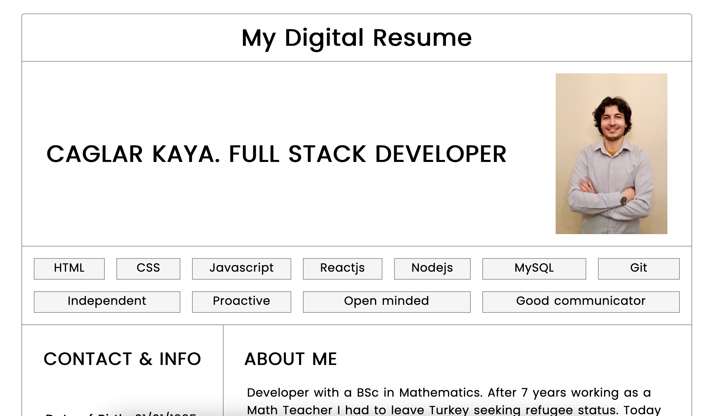
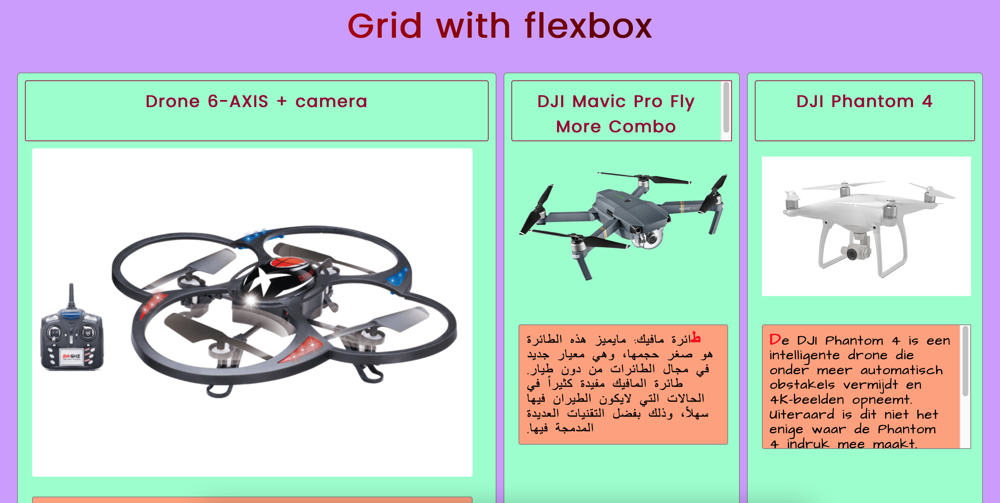
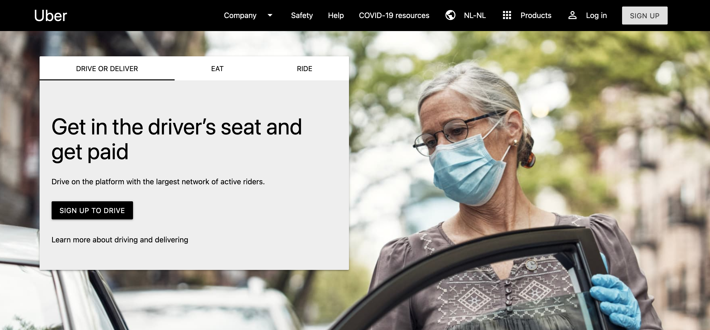

<h1 align="center" id="title">✨ HACKYOURFUTURE HTML-CSS PROJECTS ✨</h1>

  
  

> 3 HTML-CSS projects for HackYourFuture first module.

- [✨ Demo - My Digital Resume](#-demo---my-digital-resume)
- [✨ Demo - Drones Website](#-demo---drones-website)
- [✨ Demo - UBER Clone](#-demo---uber-clone)

### ✨ [Demo - My Digital Resume](https://caglar-kaya.github.io/HYF-Module-HTMLCSSGIT/week1/)

  

### ✨ [Demo - Drones Website](https://caglar-kaya.github.io/HYF-Module-HTMLCSSGIT/week2/drones-website/)

  

### ✨ [Demo - UBER Clone](https://caglar-kaya.github.io/HYF-Module-HTMLCSSGIT/week3/UBER-clone/)

  

> Created by [Caglar Kaya](https://github.com/caglar-kaya)

 These projects created using:   
 
 

 
 